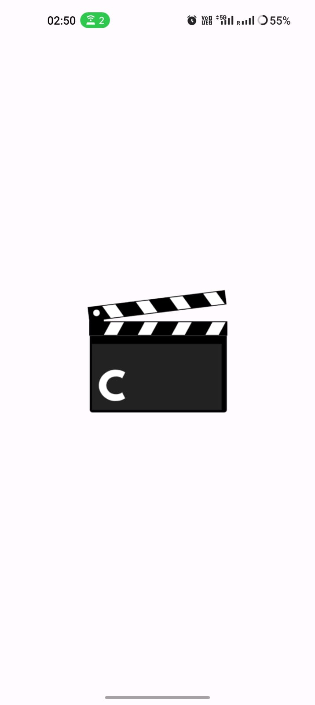
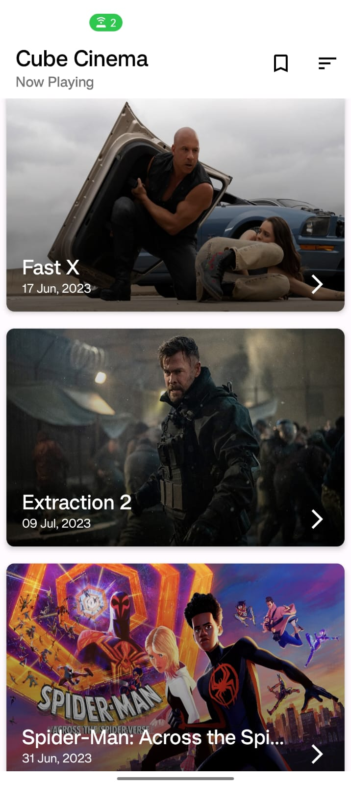
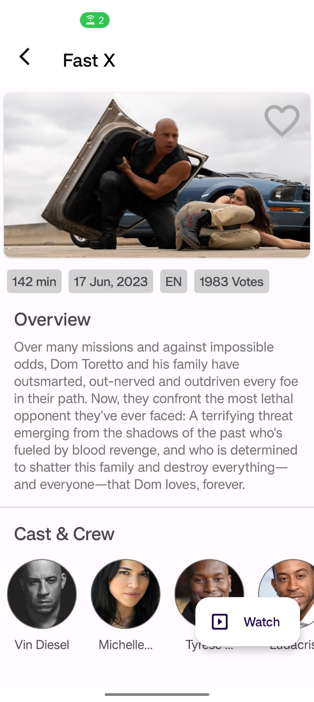
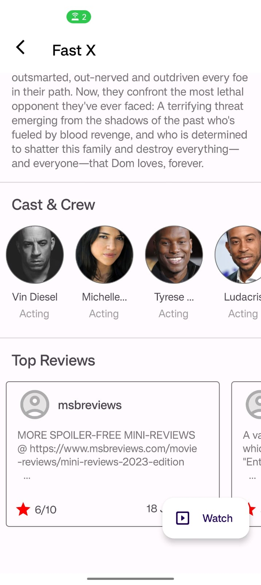
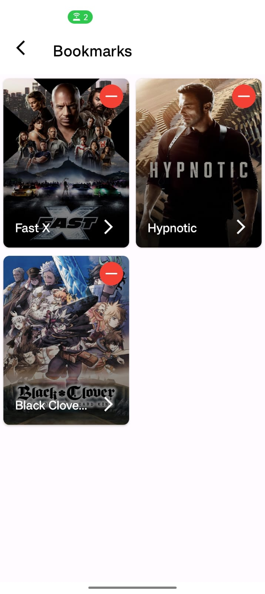
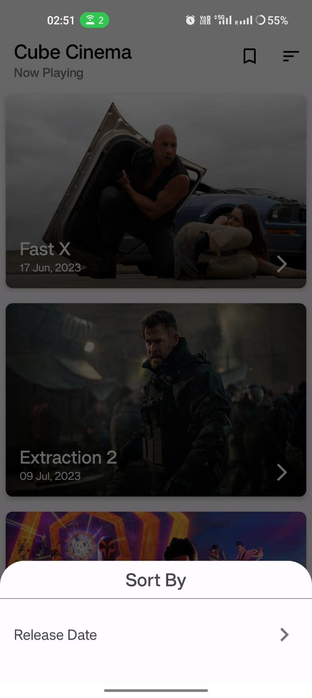

# Cube Cinema - Android Application

This application is developed as a part of a recruitment assignment for Cube Wealth.
This README file provides an overview of the application, including information on technologies used, an APK file, Demo video, and screenshots.

## Table of Contents

- [Technologies Used](#technologies-used)
- [Screenshots](#screenshots)
- [Demo Video](#demo-video)
- [APK Download](#apk-download)

## Technologies & Libraries Used

- Android Studio
- Kotlin
- XML, UI Design, Transitions, and Animations
- Object Oriented Design principles (SOLID principles, Design Patterns)
- Manual Dependency Injection
- MVVM Architecture(Model View ViewModel)
- Coroutine: Concurrency design pattern to simplify code that executes asynchronously
- LiveData: An observable data holder class that is lifecycle-aware and used to pass data between different layers of the application
- Shared Preferences: Allows activities and applications to keep preferences, in the form of key-value pairs similar to a Map that will persist even when the user closes the application
- Retrofit: A type-safe HTTP client for Android and Java used for making API requests
- Gson: It provides a powerful framework for converting between JSON strings and Java objects
- Glide: It is a fast, efficient, and widely used image loading and caching library, primarily focused on smooth scrolling
- CircleImageView Library

## Screenshots

## Demo Video

To see a demonstration of the Cube Cinema Android application, please watch the following demo video:

[

## APK Download

To download the latest APK of the Cube Cinema Android application, click the link below:

[Download APK](https://drive.google.com/file/d/1tlCGETCNuj-tz1tbbQGcoqlgVBOkreE6/view?usp=sharing)
